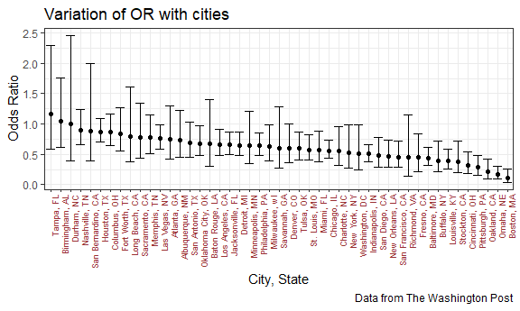

P8105\_HW6\_AA4266
================
Abhishek Ajay (aa4266)
November 25, 2018

Problem 1
=========

Here we work on the homicides data from 50 large U.S. cities that has been gathered by The Washington Post.

**Data Import**

``` r
hom_data = 
  read_csv("./data/homicide-data.csv") %>% 
  mutate(city_state = paste(city, state, sep = ", "), 
         disposition = as.factor(disposition),
         bin_disposition = as.numeric(disposition == "Closed by arrest")) %>% 
  filter(!(city_state %in% c("Dallas, TX", "Phoenix, AZ", "Kansas City, MO", "Tulsa, AL")),
         victim_race != "Unknown") %>% 
  mutate(victim_race = ifelse(victim_race == "White", "white", "non-white"),
         victim_race = fct_relevel(victim_race, "white"),
         victim_age = as.numeric(victim_age))
```

    ## Parsed with column specification:
    ## cols(
    ##   uid = col_character(),
    ##   reported_date = col_integer(),
    ##   victim_last = col_character(),
    ##   victim_first = col_character(),
    ##   victim_race = col_character(),
    ##   victim_age = col_character(),
    ##   victim_sex = col_character(),
    ##   city = col_character(),
    ##   state = col_character(),
    ##   lat = col_double(),
    ##   lon = col_double(),
    ##   disposition = col_character()
    ## )

    ## Warning in evalq(as.numeric(victim_age), <environment>): NAs introduced by
    ## coercion

In bin\_disposition, **1** means, Closed by arrest and **0** means elsewise. I removed the victims with Unknown races to avoid bias in the estimation. We could have involved the unknown victim races as non white, however, looking at the data, most of the entries with unknown race entries had other entries as unknown too. So, to remove biasness it seemed apt to just drop the race.

The race has been transformed to factor data type becuase we want to find the odds ratio of one in comparison to the other.

Now we fit a logistic regression with resolved vs unresolved as the outcome and victim age, sex and race as predictors for Baltimore, MD. We use logistic regression because our dependent variable is binary.

``` r
hom_data %>% 
  filter(city_state == "Baltimore, MD") %>% 
  glm(bin_disposition ~ victim_age + victim_sex + victim_race, data = ., family = binomial()) %>% 
  broom::tidy(exponentiate = TRUE, conf.int = TRUE) %>% 
  filter(term == "victim_racenon-white") %>% 
  select(OR = estimate, conf.low, conf.high) %>% 
  knitr::kable(digits = 3)
```

|     OR|  conf.low|  conf.high|
|------:|---------:|----------:|
|  0.441|     0.312|       0.62|

Now, the odds ratio is the odds of solving a homicide of a non-white individual/ no solving in comparison to white victims. Since our dependent variable is binary, we use logistic modelling. The tidying is done as follows.

``` r
fit_logistic_all_OR = 
  hom_data %>% 
  group_by(city_state) %>% 
  nest() %>% 
  mutate(models = map(data, ~glm(bin_disposition ~ victim_age + victim_sex + victim_race, data = ., family = binomial())), 
         results = map(.x = models, ~ broom::tidy(.x, exponentiate = TRUE, conf.int = TRUE))) %>% 
  select(-data, -models) %>% 
  unnest() %>% 
  filter(term == "victim_racenon-white") %>% 
  select(city_state, OR = estimate, conf.low, conf.high)
  
fit_logistic_all_OR %>% 
  head() %>% 
  knitr::kable(digits = 3)
```

| city\_state     |     OR|  conf.low|  conf.high|
|:----------------|------:|---------:|----------:|
| Albuquerque, NM |  0.739|     0.445|      1.220|
| Atlanta, GA     |  0.753|     0.424|      1.299|
| Baltimore, MD   |  0.441|     0.312|      0.620|
| Baton Rouge, LA |  0.668|     0.304|      1.405|
| Birmingham, AL  |  1.039|     0.612|      1.754|
| Boston, MA      |  0.116|     0.043|      0.262|

The above table shows the top 6 cities with the highest odds ratio of solving homicides comparing non-white victims to white victims.

The following will be a plot that shows the estimated ORs and CIs for each city. With cities organized according to estimated OR.

``` r
fit_logistic_all_OR %>% 
  mutate(city_state = as.factor(city_state), 
         city_state = fct_reorder(city_state, desc(OR))) %>% 
  ggplot(aes(x = city_state, y = OR)) +
  geom_point() + 
  geom_errorbar(aes(ymin = conf.low, ymax = conf.high)) +
  theme(axis.text.x = element_text(color = "#993333", angle = 90, size = rel(0.8), hjust = 1)) +
  labs(
    title = "Variation of OR with cities",
    x = "City, State",
    y = "Odds Ratio",
    caption = "Data from The Washington Post"
  )
```



It is interesting to see the except for three cities, namely, Tampa, FL; Birmingham, AL; and Durham, NC, all the other cities had an odds ratio for solving a homicide of a non white in comparison to a white as less than 1. This means that in the top 50 cities, in 94% of the cities the chances of non-white case being solved is lesser than that of a white person's case.

However, under 95% confidence interval, the upper confidence limit shows that about 56% of the cities have chances of a non-white case being solved being lesser than a white person's case.

Problem 2
=========

The child birth weight data is imported and cleaned as follows.

``` r
child_bwt_data = 
  read_csv("./data/birthweight.csv") %>% 
  mutate(babysex = as.factor(babysex), 
         frace = as.factor(frace),
         mrace = as.factor(mrace),
         malform = as.factor(malform),
         partiy = as.factor(parity)) %>% 
  select(-pnumlbw, -pnumsga) %>% 
  select(bwt, babysex, everything())
  #they are always constant and equal to 0 so can be dropped. 
```

In the above chunk, the babysex, father's race, mother's race, presence of malformations and parity are converted to factors. This is due to the categorical nature of the variable. Previous number of low birth weight babies and number of prior small for gestational age babies, i.e the *pnumlbw* and *pnumsga* columns respectively, are dropped since they are constant all through the data set and equal to 0.

Here we propose a regression model for the birthweight using *stepwise regression* with *backward elimination*. This is a data driven model building-process where the predictors that lower the AIC (Akaike information criterion) the most from the starting AIC value are dropped sequentially after each run.

``` r
fit_mlr_child_bwt = lm(bwt ~ ., data = child_bwt_data) #data fitting

#fit_mlr_child_bwt %>% 
#  broom::tidy() %>% 
#  knitr::kable()

backward_elim_child_bwt_predictors =
  step(fit_mlr_child_bwt, direction = "backward") %>% 
  broom::tidy()#stepwise regression using backward elimination
```

The predictors finally chosen for our linear regression model are:

|           |               |              |               |               |              |              |              |              |              |              |              |              |              |              |              |              |
|:----------|:--------------|:-------------|:--------------|:--------------|:-------------|:-------------|:-------------|:-------------|:-------------|:-------------|:-------------|:-------------|:-------------|:-------------|:-------------|:-------------|
| term      | (Intercept)   | babysex2     | bhead         | blength       | delwt        | fincome      | gaweeks      | mheight      | mrace2       | mrace3       | mrace4       | ppwt         | smoken       | partiy1      | partiy3      | partiy6      |
| estimate  | -6097.7043334 | 28.4982919   | 130.7266516   | 74.9841630    | 4.1092124    | 0.3200529    | 11.5773486   | 6.5789862    | -138.9299485 | -74.9088912  | -100.7047096 | -2.6762665   | -4.8477289   | 298.2465585  | 210.4502088  | 583.4559698  |
| std.error | 137.5848037   | 8.4568554    | 3.4477458     | 2.0199050     | 0.3921336    | 0.1748024    | 1.4638454    | 1.7853204    | 9.9109732    | 42.3213473   | 19.3280218   | 0.4274697    | 0.5857236    | 272.6444247  | 272.6151286  | 273.8308892  |
| statistic | -44.3196063   | 3.3698450    | 37.9165573    | 37.1226183    | 10.4791144   | 1.8309413    | 7.9088602    | 3.6850450    | -14.0177907  | -1.7700025   | -5.2102957   | -6.2607157   | -8.2764783   | 1.0939030    | 0.7719682    | 2.1307164    |
| p.value   | 0.000000e+00  | 7.586896e-04 | 7.060195e-272 | 4.132636e-262 | 2.164959e-25 | 6.717805e-02 | 3.272805e-15 | 2.314611e-04 | 1.082165e-43 | 7.679715e-02 | 1.973157e-07 | 4.204441e-10 | 1.672211e-16 | 2.740584e-01 | 4.401754e-01 | 3.316876e-02 |

So, the porposed regression model is:

``` r
new_fit_mlr_child_bwt = 
  lm(bwt ~ parity + fincome + babysex + mheight + ppwt + gaweeks + smoken + delwt + mrace + blength + bhead, data = child_bwt_data)

new_fit_mlr_child_bwt %>% 
  broom::tidy()
```

    ## # A tibble: 14 x 5
    ##    term         estimate std.error statistic   p.value
    ##    <chr>           <dbl>     <dbl>     <dbl>     <dbl>
    ##  1 (Intercept) -6099.      138.       -44.3  0.       
    ##  2 parity         96.3      40.3        2.39 1.70e-  2
    ##  3 fincome         0.318     0.175      1.82 6.88e-  2
    ##  4 babysex2       28.6       8.45       3.38 7.37e-  4
    ##  5 mheight         6.59      1.78       3.69 2.23e-  4
    ##  6 ppwt           -2.68      0.427     -6.26 4.20e- 10
    ##  7 gaweeks        11.6       1.46       7.93 2.79e- 15
    ##  8 smoken         -4.84      0.586     -8.27 1.75e- 16
    ##  9 delwt           4.11      0.392     10.5  2.26e- 25
    ## 10 mrace2       -139.        9.91     -14.0  1.21e- 43
    ## 11 mrace3        -74.9      42.3       -1.77 7.68e-  2
    ## 12 mrace4       -101.       19.3       -5.21 1.98e-  7
    ## 13 blength        74.9       2.02      37.1  4.29e-262
    ## 14 bhead         131.        3.45      37.9  3.10e-272

Showing a plot of model residuals against fitted values using add\_predictions and add\_residuals.

``` r
child_bwt_data %>% 
  add_predictions(new_fit_mlr_child_bwt) %>% 
  add_residuals(new_fit_mlr_child_bwt) %>% 
  ggplot(aes(x = pred, y = resid)) +
  geom_point(alpha = 0.4) +
  labs(
    title = "Residuals against fitted values for the new model",
    x = "Fitted Values", 
    y = "Residuals"
  )
```


### Comparison of the above model with the following two models:

MLR\_1 : One using length at birth and gestational age as predictors (main effects only)

MLR\_2 : One using head circumference, length, sex, and all interactions (including the three-way interaction) between these

In the following code chunk, cross validation is carried out followed by a plot to compare the spread of *root mean squares* in the three models.

``` r
fit_mlr_1 = lm(bwt ~ blength + gaweeks, data = child_bwt_data)
fit_mlr_2 = lm(bwt ~ bhead*blength*babysex, data = child_bwt_data) #multiple regression with interaction

#Cross Validating

cv_df = 
  crossv_mc(child_bwt_data, n = 100) %>% 
  mutate(train = map(train, as_tibble),
         test = map(test, as_tibble)) %>% 
  mutate(proposed_mlr  = map(train, ~lm(bwt ~ parity + fincome + babysex + mheight + ppwt + gaweeks + smoken + delwt + mrace + blength + bhead, data = .x)),
         mlr_1 = map(train, ~lm(bwt ~ blength + gaweeks, data = .x)),
         mlr_2 = map(train, ~lm(bwt ~ bhead*blength*babysex, data = .x))
  ) %>% 
  mutate(rmse_proposed  = map2_dbl(proposed_mlr,  test, ~rmse(model = .x, data = .y)),
         rmse_mlr_1 = map2_dbl(mlr_1, test, ~rmse(model = .x, data = .y)),
         rmse_mlr_2 = map2_dbl(mlr_2, test, ~rmse(model = .x, data = .y))
  )
```

    ## Warning in predict.lm(model, data): prediction from a rank-deficient fit
    ## may be misleading

``` r
cv_df %>% 
  select(starts_with("rmse")) %>% 
  gather(key = model, value = rmse) %>% 
  mutate(model = str_replace(model, "rmse_", ""),
         model = fct_inorder(model)) %>% 
  ggplot(aes(x = model, y = rmse)) + geom_violin() + 
  labs(
    title = "Comparison of the proposed model with two alternative models",
    x = "Models", 
    y = "Root mean squares"
  )
```


The proposed model using backward elimination stepwise regression is the clear winner here with the highest prediction accuracy. We see that the first suggested alternative bwt ~ blengths + gaweeks has the largest RMSE while the other suggested model is lower but still larger than the proposed model.
